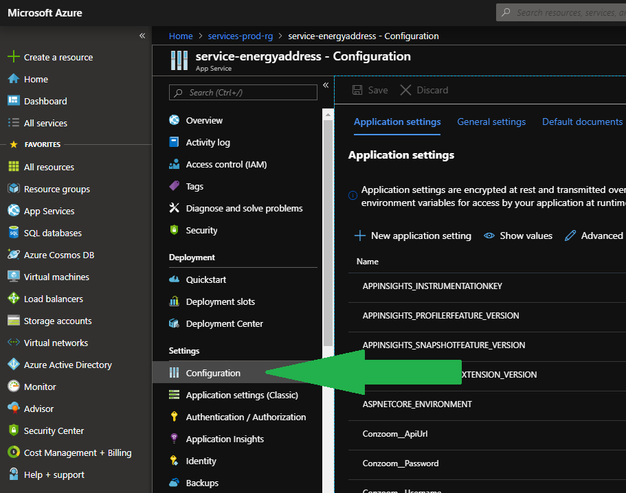
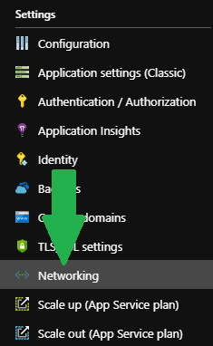

# Configuration and Envionment Setup

Everything secret should be configured in the hosting environment. The local `appsettings.json` files should **ONLY** be used for common configuration and **NOT** secrets.

Should secrets be needed during development, these should be put into the `UserSecrets` file, managed by Visual Studio. This file is accessed by right-clicking the `Api.Web` project and selecting `Manage User Secrets`.

## Azure configuration
Azure provides built-in configuration management. Found within the App Service, which is also shown on the image below.

- Settings
  - Configuration

## On-premise and Hybrid-Connections

When a connection to some on-premise service is needed. The Hybrid-Connection must be enabled. This setting is fould within the App Service, which also is shown in the image below.

